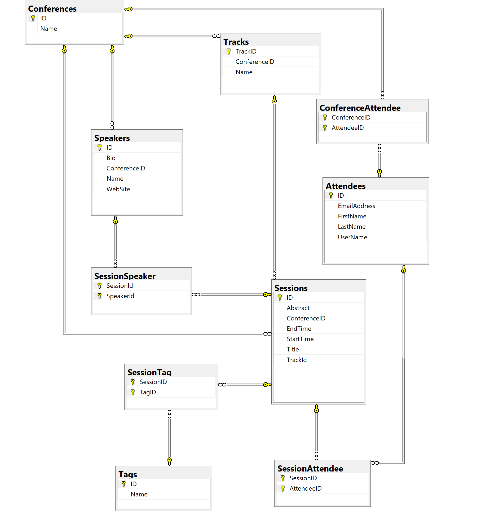

# Getting started with GraphQL on ASP.NET Core and Hot Chocolate - Workshop

If you want to browse the GraphQL server head over [here](https://hc-conference-app.azurewebsites.net/).

## Prerequisites

For this workshop we need a couple of prerequisites. First, we need the [.NET SDK 5.0](https://dotnet.microsoft.com/download/dotnet/5.0).

Then we need some IDE/Editor in order to do some proper C# coding, you can use [VSCode](https://code.visualstudio.com/) or if you have already on your system Visual Studio or JetBrains Rider.

Last but not least we will use our GraphQL IDE [Banana Cake Pop](https://hotchocolate.io/docs/banana-cakepop).

> Note: When installing Visual Studio you only need to install the `ASP.NET and web development` workload.

## What you'll be building

In this workshop, you'll learn by building a full-featured GraphQL Server with ASP.NET Core and Hot Chocolate from scratch. We'll start from File/New and build up a full-featured GraphQL server with custom middleware, filters, subscription and relay support.

**Database Schema**:

**GraphQL Schema**:

The GraphQL schema can be found [here](code/complete/schema.graphql).

## Sessions

| Session | Topics |
| ----- | ---- |
| [Session #1](docs/1-creating-a-graphql-server-project.md) | Building a basic GraphQL server API. |
| [Session #2](docs/2-controlling-nullability.md) | Controlling nullability.  |
| [Session #3](docs/3-understanding-dataLoader.md) | Understanding GraphQL query execution and DataLoader.  |
| [Session #4](docs/4-schema-design.md) | GraphQL schema design approaches. |
| [Session #5](docs/5-understanding-middleware.md) | Understanding middleware. |
| [Session #6](docs/6-adding-complex-filter-capabilities.md) | Adding complex filter capabilities. |
| [Session #7](docs/7-subscriptions.md) | Adding real-time functionality with subscriptions. |
| [Session #8](docs/8-testing-the-graphql-server.md) | Testing the GraphQL server. |
