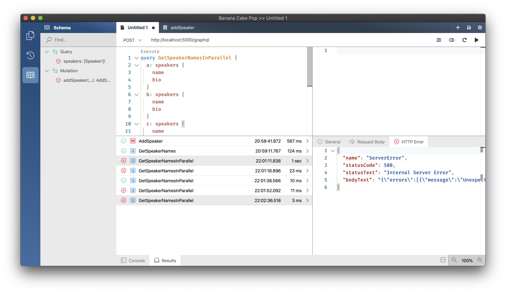
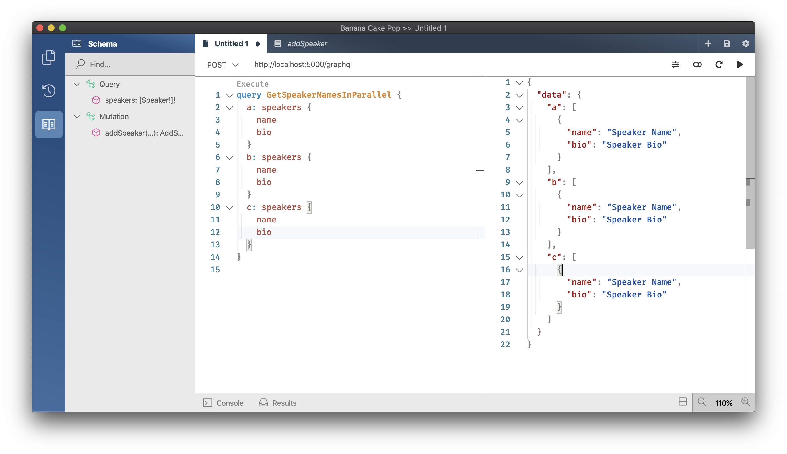
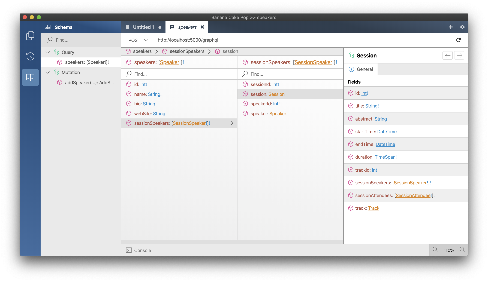
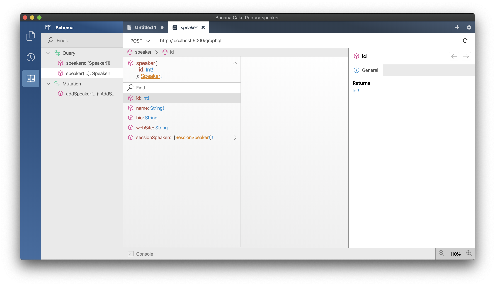
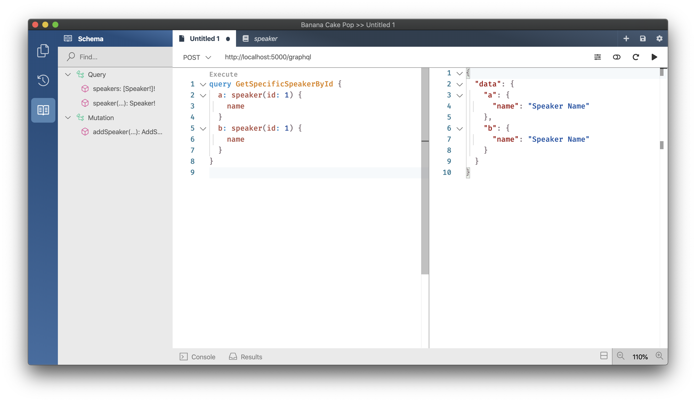

# Controlling nullability and understanding DataLoader

## Configure field scoped services

The GraphQL execution engine will always try to execute fields in parallel in order to optimize data-fetching and reduce wait time. Entity Framework will have a problem with that since a `DBContext` is not thread-safe. Let us first create the issue and run into this problem before fixing it.

1. Start your GraphQL Server.
   1. `dotnet run --project Graphql`

1. Start Banana Cake Pop and run the following query:

   ```graphql
   query GetSpeakerNamesInParallel {
     a: speakers {
       name
       bio
     }
     b: speakers {
       name
       bio
     }
     c: speakers {
       name
       bio
     }
   }
   ```

   

    We ran the field to fetch the speaker three times in parallel, which used the same `DBContext` and lead to the exception by the `DBContext`.

    We have the option either set the execution engine to execute serially, which is terrible for     performance or to use `DBContext` pooling in combination with field scoped services.

    Using `DBContext` pooling allows us to issue a `DBContext` instance for each field needing one. But instead of creating a `DBContext` instance for every field and throwing it away after using it, we are renting so fields and requests can reuse it.

1. Head over to the `Startup.cs` and replace `services.AddDbContext` with `services.AddDbContextPool`.

   old:
   `services.AddDbContext<ApplicationDbContext>(options => options.UseSqlite("Data Source=conferences.db"));`

   new:
   `services.AddDbContextPool<ApplicationDbContext>(options => options.UseSqlite("Data Source=conferences.db"));`

   > By default the `DBContext` pool will keep 128 `DBContext` instances in its pool.

1. Create a new folder called `Extensions`
   1. `mkdir GraphQL/Extensions`

1. Create a new file located in `Extensions` called `ObjectFieldDescriptorExtensions.cs` with the following code:

   ```csharp
   using Microsoft.EntityFrameworkCore;
   using Microsoft.EntityFrameworkCore.Internal;
   using Microsoft.Extensions.DependencyInjection;
   using HotChocolate.Types;

   namespace ConferencePlanner.GraphQL
   {
       public static class ObjectFieldDescriptorExtensions
       {
           public static IObjectFieldDescriptor UseDbContext<TDbContext>(
               this IObjectFieldDescriptor descriptor)
               where TDbContext : DbContext
           {
               return descriptor.UseScopedService<TDbContext>(
                   create: s => s.GetRequiredService<DbContextPool<TDbContext>>().Rent(),
                   dispose: (s, c) => s.GetRequiredService<DbContextPool<TDbContext>>().Return(c));
           }
      }
   }
   ```

   > The `UseDbContext` will create a new middleware that handles scoping for a field.
   > The `create` part will rent from the pool a `DBContext`, the `dispose`
   > part will return it after the middleware is finished.

1. Create another file located in `Extensions` called `UseApplicationDbContextAttribute.cs` with the following code:

   ```csharp
   using HotChocolate.Types;
   using HotChocolate.Types.Descriptors;
   using System.Reflection;
   using ConferencePlanner.GraphQL.Data;

   namespace ConferencePlanner.GraphQL
   {
       public class UseApplicationDbContextAttribute : ObjectFieldDescriptorAttribute
       {
           public override void OnConfigure(
               IDescriptorContext context,
               IObjectFieldDescriptor descriptor,
               MemberInfo member)
           {
               descriptor.UseDbContext<ApplicationDbContext>();
           }
       }
   }
   ```

   > The above code creates a so-called `Descriptor` attribute and allows us to wrap GraphQL
   > configuration into attributes that you can apply to type system members.

1. Next, head over to the `Query.cs` and change it like the following:

   ```csharp
   using HotChocolate;
   using ConferencePlanner.GraphQL.Data;
   using Microsoft.EntityFrameworkCore;
   using System.Collections.Generic;
   using System.Threading.Tasks;

   namespace ConferencePlanner.GraphQL
   {
       public class Query
       {
           [UseApplicationDbContext]
           public Task<List<Speaker>> GetSpeakers([ScopedService] ApplicationDbContext context) =>
               context.Speakers.ToListAsync();
       }
   }
   ```

   > By annotating `UseApplicationDbContext` we are essentially applying a Middleware to the field resolver pipeline. We will have a more in-depth look into filed middleware later on.

1. Now head over to the `Mutation.cs` and do the same there:

   ```csharp
   using System.Threading.Tasks;
   using ConferencePlanner.GraphQL.Data;
   using HotChocolate;

   namespace ConferencePlanner.GraphQL
   {
       public class Mutation
       {
           [UseApplicationDbContext]
           public async Task<AddSpeakerPayload> AddSpeakerAsync(
               AddSpeakerInput input,
               [ScopedService] ApplicationDbContext context)
           {
               var speaker = new Speaker
               {
                   Name = input.Name,
                   Bio = input.Bio,
                   WebSite = input.WebSite
               };

               context.Speakers.Add(speaker);
               await context.SaveChangesAsync();

               return new AddSpeakerPayload(speaker, input.ClientMutationId);
           }
       }
   }
   ```

1. Start your GraphQL Server again.
   1. `dotnet run --project Graphql`

1. Start Banana Cake Pop again and run the following query again:

   ```graphql
   query GetSpeakerNamesInParallel {
     a: speakers {
       name
       bio
     }
     b: speakers {
       name
       bio
     }
     c: speakers {
       name
       bio
     }
   }
   ```

   

   This time our query works like expected.

## Adding the remaining data models

In order to expand our GraphQL server model further we've got several more data models to add, and unfortunately it's a little mechanical. You can copy the following classes manually, or open the completed solution which is shown at the end.

1. Create an `Attendee.cs` class in the `Data` directory with the following code:

   ```csharp
   using System.Collections.Generic;
   using System.ComponentModel.DataAnnotations;

   namespace ConferencePlanner.GraphQL.Data
   {
       public class Attendee
       {
           public int Id { get; set; }

           [Required]
           [StringLength(200)]
           public string? FirstName { get; set; }

           [Required]
           [StringLength(200)]
           public string? LastName { get; set; }

           [Required]
           [StringLength(200)]
           public string? UserName { get; set; }

           [StringLength(256)]
           public string? EmailAddress { get; set; }

           public ICollection<SessionAttendee> SessionsAttendees { get; set; } =
               new List<SessionAttendee>();
       }
   }
   ```

1. Create a `Session.cs` class with the following code:

   ```csharp
   using System;
   using System.Collections.Generic;
   using System.ComponentModel.DataAnnotations;

   namespace ConferencePlanner.GraphQL.Data
   {
       public class Session
       {
           public int Id { get; set; }

           [Required]
           [StringLength(200)]
           public string? Title { get; set; }

           [StringLength(4000)]
           public string? Abstract { get; set; }

           public DateTimeOffset? StartTime { get; set; }

           public DateTimeOffset? EndTime { get; set; }

           // Bonus points to those who can figure out why this is written this way
           public TimeSpan Duration => 
               EndTime?.Subtract(StartTime ?? EndTime ?? DateTimeOffset.MinValue) ?? 
                   TimeSpan.Zero;

           public int? TrackId { get; set; }

           public ICollection<SessionSpeaker> SessionSpeakers { get; set; } = 
               new List<SessionSpeaker>();

           public ICollection<SessionAttendee> SessionAttendees { get; set; } = 
               new List<SessionAttendee>();

           public Track? Track { get; set; }
       }
   }
   ```

1. Create a new `Track.cs` class with the following code:

   ```csharp
   using System.Collections.Generic;
   using System.ComponentModel.DataAnnotations;

   namespace ConferencePlanner.GraphQL.Data
   {
       public class Track
       {
           public int Id { get; set; }

           [Required]
           [StringLength(200)]
           public string? Name { get; set; }

           public ICollection<Session> Sessions { get; set; } = 
               new List<Session>();
       }
   }
   ```

1. Create a `SessionAttendee.cs` class with the following code:

   ```csharp
   namespace ConferencePlanner.GraphQL.Data
   {
       public class SessionAttendee
       {
           public int SessionId { get; set; }

           public Session? Session { get; set; }

           public int AttendeeId { get; set; }

           public Attendee? Attendee { get; set; }
       }
   }
   ```

1. Create a `SessionSpeaker` class with the following code:

   ```csharp
   namespace ConferencePlanner.GraphQL.Data
   {
       public class SessionSpeaker
       {
           public int SessionId { get; set; }

           public Session? Session { get; set; }

           public int SpeakerId { get; set; }

           public Speaker? Speaker { get; set; }
       }
   }
   ```

1. Next, modify the `Speaker` class and add the following property to it:

   ```csharp
   public ICollection<SessionSpeaker> SessionSpeakers { get; set; } = 
       new List<SessionSpeaker>();
   ```

    The class should now look like the following:

   ```csharp
   using System.Collections.Generic;
   using System.ComponentModel.DataAnnotations;
   using System.Linq;
   using System.Threading.Tasks;

   namespace ConferencePlanner.GraphQL.Data
   {
       public class Speaker
       {
           public int Id { get; set; }

           [Required]
           [StringLength(200)]
           public string? Name { get; set; }

           [StringLength(4000)]
           public string? Bio { get; set; }

           [StringLength(1000)]
           public string? WebSite { get; set; }

           public ICollection<SessionSpeaker> SessionSpeakers { get; set; } = 
               new List<SessionSpeaker>();
       }
   }
   ```

1. Last but not least, update the `ApplicationDbContext` with the following code:

   ```csharp
   using Microsoft.EntityFrameworkCore;

   namespace ConferencePlanner.GraphQL.Data
   {
       public class ApplicationDbContext : DbContext
       {
           public ApplicationDbContext(DbContextOptions<ApplicationDbContext> options)
               : base(options)
           {
           }

           protected override void OnModelCreating(ModelBuilder modelBuilder)
           {
               modelBuilder
                   .Entity<Attendee>()
                   .HasIndex(a => a.UserName)
                   .IsUnique();

               // Many-to-many: Session <-> Attendee
               modelBuilder
                   .Entity<SessionAttendee>()
                   .HasKey(ca => new { ca.SessionId, ca.AttendeeId });

               // Many-to-many: Speaker <-> Session
               modelBuilder
                   .Entity<SessionSpeaker>()
                   .HasKey(ss => new { ss.SessionId, ss.SpeakerId });
           }

           public DbSet<Session> Sessions { get; set; } = default!;

           public DbSet<Track> Tracks { get; set; } = default!;

           public DbSet<Speaker> Speakers { get; set; } = default!;

           public DbSet<Attendee> Attendees { get; set; } = default!;
       }
   }
   ```

Now, that we have all of our models in we need to create another migration and update our database.

1. First, validate your project by building it.

   ```console
    dotnet build GraphQL
   ```

1. Next, generate a new migration for the database.

   ```console
    dotnet ef migrations add Refactoring --project GraphQL
   ```

1. Last, update the database with the new migration.

   ```console
    dotnet ef database update --project GraphQL
   ```

After having everything in let us have a look at our schema and see if something changed.

1. Start, your server.

   ```console
    dotnet run --project GraphQL
   ```

1. Open Banana Cake Pop and refresh the schema.

1. Head over to the schema explorer and have a look at the speaker.

   

## Adding DataLoader

1. Add a new directory `DataLoader` to your project:

   ```console
    mkdir GraphQL/DataLoader
   ```

1. Add a new class called `SpeakerByIdDataLoader` to the `DataLoader` directory with the following code:

   ```csharp
   using System;
   using System.Collections.Generic;
   using System.Linq;
   using System.Threading;
   using System.Threading.Tasks;
   using Microsoft.EntityFrameworkCore;
   using Microsoft.EntityFrameworkCore.Internal;
   using ConferencePlanner.GraphQL.Data;
   using HotChocolate.DataLoader;

   namespace ConferencePlanner.GraphQL.DataLoader
   {
       public class SpeakerByIdDataLoader : BatchDataLoader<int, Speaker>
       {
           private readonly DbContextPool<ApplicationDbContext> _dbContextPool;

           public SpeakerByIdDataLoader(DbContextPool<ApplicationDbContext> dbContextPool)
           {
               _dbContextPool = dbContextPool ?? throw new ArgumentNullException(nameof(dbContextPool));
           }

           protected override async Task<IReadOnlyDictionary<int, Speaker>> LoadBatchAsync(
               IReadOnlyList<int> keys, 
               CancellationToken cancellationToken)
           {
               ApplicationDbContext dbContext = _dbContextPool.Rent();
               try
               {
                   return await dbContext.Speakers
                       .Where(s => keys.Contains(s.Id))
                       .ToDictionaryAsync(t => t.Id, cancellationToken);
               }
               finally
               {
                   _dbContextPool.Return(dbContext);
               }
           }
       }
   }
   ```

1. Now, register your `DataLoader` with the dependency injection like the following in the `Startup.cs`:

   ```csharp
   services.AddDataLoader<SpeakerByIdDataLoader>();
   ```

1. Add a new method `GetSpeakerAsync` to your `Query.cs`.

   ```csharp
   public Task<Speaker> GetSpeakerAsync(
       int id,
       SpeakerByIdDataLoader dataLoader,
       CancellationToken cancellationToken) =>
       dataLoader.LoadAsync(id, cancellationToken);
   ```

   The `Query.cs` should now look like the following:

   ```csharp
   using HotChocolate;
   using ConferencePlanner.GraphQL.Data;
   using Microsoft.EntityFrameworkCore;
   using System.Collections.Generic;
   using System.Threading.Tasks;
   using ConferencePlanner.GraphQL.DataLoader;
   using System.Threading;

   namespace ConferencePlanner.GraphQL
   {
       public class Query
       {
           [UseApplicationDbContext]
           public Task<List<Speaker>> GetSpeakersAsync(
               [ScopedService] ApplicationDbContext context) =>
               context.Speakers.ToListAsync();

           public Task<Speaker> GetSpeakerAsync(
               int id,
               SpeakerByIdDataLoader dataLoader,
               CancellationToken cancellationToken) =>
               dataLoader.LoadAsync(id, cancellationToken);
       }
   }
   ```

1. Let us have a look at the new schema with Banana Cake Pop. For this start your server and refresh Banana Cake Pop.

   ```console
   dotnet run --project GraphQL
   ```

   

1. Now try out if the new field works right.

   ```graphql
   query GetSpecificSpeakerById {
     a: speaker(id: 1) {
       name
     }
     b: speaker(id: 1) {
       name
     }
   }
   ```

   

## Fluent type configurations

At this very moment, we are purely inferring the schema from our C# classes. In some cases where we have everything under control, this might be a good thing, and everything is okay.

But if we, for instance, have some parts of the API not under control and want to change the GraphQL schema representation of these APIs, fluent type configurations can help. With Hot Chocolate, we can mix in those type configurations where we need them or even go full in and declare our whole schema purely with our fluent type API.

In our specific case, we want to make the GraphQL API nicer and remove the relationship objects like `SessionSpeaker`.

1. Create a new file `SessionBySpeakerIdDataLoader` in the `DataLoader` directory with the following code:

   ```csharp
   using System;
   using System.Collections.Generic;
   using System.Linq;
   using System.Threading;
   using System.Threading.Tasks;
   using Microsoft.EntityFrameworkCore;
   using Microsoft.EntityFrameworkCore.Internal;
   using ConferencePlanner.GraphQL.Data;
   using HotChocolate.DataLoader;

   namespace ConferencePlanner.GraphQL.DataLoader
   {
       public class SessionBySpeakerIdDataLoader : GroupedDataLoader<int, Session>
       {
           private readonly DbContextPool<ApplicationDbContext> _dbContextPool;

           public SessionBySpeakerIdDataLoader(DbContextPool<ApplicationDbContext> dbContextPool)
           {
               _dbContextPool = dbContextPool ?? throw new ArgumentNullException(nameof(dbContextPool));
           }

           protected override async Task<ILookup<int, Session>> LoadGroupedBatchAsync(
               IReadOnlyList<int> keys,
               CancellationToken cancellationToken)
           {
               ApplicationDbContext dbContext = _dbContextPool.Rent();
               try
               {
                   List<SessionSpeaker> speakers = await dbContext.Speakers
                       .Where(speaker => keys.Contains(speaker.Id))
                       .Include(speaker => speaker.SessionSpeakers)
                       .SelectMany(speaker => speaker.SessionSpeakers)
                       .Include(sessionSpeaker => sessionSpeaker.Session)
                       .ToListAsync();

                   return speakers
                       .Where(t => t.Session is { })
                       .ToLookup(t => t.SpeakerId, t => t.Session!);
               }
               finally
               {
                   _dbContextPool.Return(dbContext);
               }
           }
       }
   }
   ```

1. Next, register your DataLoader with the dependency injection by adding the following like to your `Startup.cs`:

   ```csharp
   services.AddDataLoader<SessionBySpeakerIdDataLoader>();
   ```

1. Create a new directory `Types`.

   ```console
   mkdir GraphQL/Types
   ```

1. Create a new class `SessionType` in the directory types with the following code:

   ```csharp
   using System.Collections.Generic;
   using System.Threading;
   using System.Threading.Tasks;
   using ConferencePlanner.GraphQL.Data;
   using ConferencePlanner.GraphQL.DataLoader;
   using HotChocolate.Types;

   namespace ConferencePlanner.GraphQL.Types
   {
       public class SpeakerType : ObjectType<Speaker>
       {
           protected override void Configure(IObjectTypeDescriptor<Speaker> descriptor)
           {
               descriptor
                   .Field(t => t.SessionSpeakers)
                   .ResolveWith<SpeakerResolvers>(t => t.GetSessionsAsync(default!, default!, default))
                   .Name("sessions");
           }

           private class SpeakerResolvers
           {
               public async Task<IEnumerable<Session>> GetSessionsAsync(
                   Speaker speaker,
                   SessionBySpeakerIdDataLoader sessionBySpeakerId,
                   CancellationToken cancellationToken) =>
                   await sessionBySpeakerId.LoadAsync(speaker.Id, cancellationToken);
           }
       }
   }
   ```

   > In the type configuration we are giving `SessionSpeakers` a new name `sessions`.
   > Also, we are binding a new resolver to this field which also rewrites the result type.
   > The new field `sessions` now returns `[Session]`.

1. Register the type with the schema builder in the `Startup.cs`:

   ```csharp
   services.AddGraphQL(
       SchemaBuilder.New()
           .AddQueryType<Query>()
           .AddMutationType<Mutation>()
           .AddType<SessionType>());
   ```

   The new GraphQL representation of our speaker type is now:

   ```GraphQL
   type Speaker {
       id: Int!
       name: String!
       sessions: [Sessions!]!
       bio: String
       bio: String
   }
   ```

1. Start your GraphQL server again.

   ```console
   dotnet run --project GraphQL
   ```

1. Go back to Banana Cake Pop, refresh the schema and execute the following query:

   ```graphql
    query GetSpeakerWithSessions {
       speaker {
           name
           sessions {
               title
           }
       }
    }
   ```

   > Since we do not have any data for sessions yet the server will return an empty list for session. Still, our server works already and we will soon be able to add more data.

## Summary

In this session, we have further discovered the GraphQL type system, by understanding how nullability works in GraphQL and how Hot Chocolate infers nullability from .NET types. We have found new ways to declare types with the fluent configuration API and schema types.

Further, we have added batch- and group-DataLoader to our GraphQL API and learned what DataLoader is.
